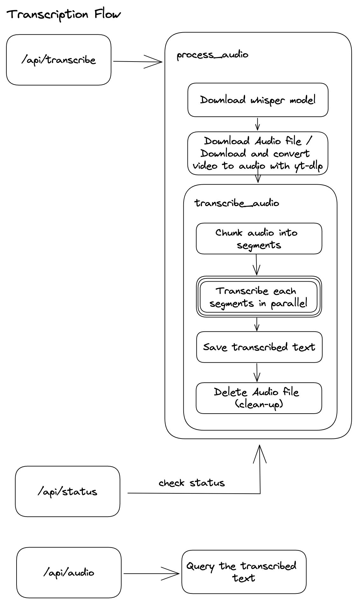

## Fast Audio/Video transcribe using Openai's Whisper and Modal

##### Powered by Modal.com for parallel processing on-demand, an hour audio file can be transcribed in ~1 minute.

"Modal’s dead-simple parallelism primitives are the key to doing the transcription so quickly. Even with a GPU, transcribing a full episode serially was taking around 10 minutes. But by pulling in ffmpeg with a simple .pip_install("ffmpeg-python") addition to our Modal Image, we could exploit the natural silences of the podcast medium to partition episodes into hundreds of short segments. Each segment is transcribed by Whisper in its own container task with 2 physical CPU cores, and when all are done we stitch the segments back together with only a minimal loss in transcription quality. This approach actually accords quite well with Whisper’s model architecture:"

> “The Whisper architecture is a simple end-to-end approach, implemented as an encoder-decoder Transformer. Input audio is split into 30-second chunks, converted into a log-Mel spectrogram, and then passed into an encoder.” - Introducing Whisper



### Demo

Audio Transcription

https://user-images.githubusercontent.com/15852818/221420836-9daf7e89-dbc3-407b-8d49-88877cf52e2a.mp4

Video Transcription

https://user-images.githubusercontent.com/15852818/221420839-e5c91172-b6d9-40f7-806d-dc5122568de9.mp4

### How to use

1. Create a Modal account and get your API key.

   - Run this command to install modal client and generate token.

     ```bash
     pip install modal-client
     modal token new
     ```

     - The first command will install the Modal client library on your computer, along with its dependencies.

     - The second command creates an API token by authenticating through your web browser. It will open a new tab, but you can close it when you are done.

2. Deploy your modal project with the following command.

   ```bash
   modal deploy api.main
   ```

3. Transcribe your audio file using the following curl command. Replace the `your-modal-endpoint`, `your-audio-src-url`, `title_slug`, and `is_video`(for video transcribe) with your own.

   ```curl
   curl --location --request POST 'your-modal-endpoint/api/transcribe?src_url=your-audio-src-url&title_slug=your-amazing-title-slug&is_video=false'
   ```

   Sample response:

   ```json
   {
     "call_id": "your-call-id"
   }
   ```

4. Check the status of your transcription using the following curl command. Replace the `your-call-id` with your own (return from the previous command).

   ```curl
    curl --location 'your-modal-endpoint/api/status/your-call-id'
   ```

   Sample initial response:

   ```json
   {
     "finished": false,
     "total_segments": 49,
     "tasks": 49,
     "done_segments": 0
   }
   ```

   Sample final response(poll this endpoint until `finished` is `true`):

   ```json
   {
     "finished": true,
     "total_segments": 49,
     "tasks": 49,
     "done_segments": 49
   }
   ```

5. Download the transcription using the following curl command. Replace the `your-modal-endpoint` and `your-title-slug` with your own (return from the previous command).

   ```curl
    curl --location 'your-modal-endpoint/api/audio/your-title-slug'
   ```

   Sample response:

   ```json
   {
     "segments": [
       {
         "text": " Productivity also means that you're able to maximize the hours that you have and also rest deliberately in between.  That's real productivity because if you're just constantly working without breaks and without really knowing what your goals are and what you're achieving,",
         "start": 0.0,
         "end": 19.0
       },
       {
         "text": " that's not productivity, that's just busyness.  So that's the difference between productivity and busyness and it really starts from the very beginning of your day.",
         "start": 19.0,
         "end": 45.0
       }
     ]
   }
   ```

Resources:

- https://modal.com/docs/guide/whisper-transcriber (most of the codes were recycled from here)
- https://openai.com/blog/whisper/
